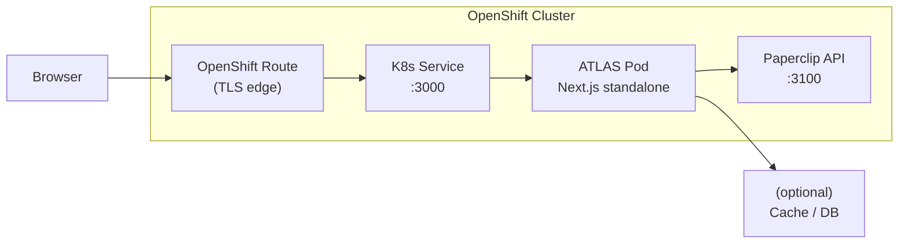

# ATLAS

ATLAS is a real-time operational dashboard for [Paperclip](https://github.com/paperclipai/paperclip) agent companies. It provides board-level visibility into agent activity, task progress, budget consumption, and system health — connecting to a Paperclip control plane instance via its REST API.

## Architecture



## Quick Start (Local Development)

```bash
# 1. Clone and install
git clone <repo-url> atlas-app
cd atlas-app
npm install

# 2. Configure environment
cp .env.example .env
# Edit .env with your Paperclip API key and other values

# 3. Run dev server
npm run dev
```

Open [http://localhost:3000](http://localhost:3000) in your browser.

## OpenShift Deployment

### Prerequisites

- OpenShift cluster with `oc` CLI authenticated
- A running Paperclip instance in the `paperclip` namespace
- A board API key from Paperclip

### Steps

```bash
# 1. Create the namespace (if it doesn't exist)
oc new-project paperclip || oc project paperclip

# 2. Build and push the image
oc new-build --name=atlas --binary --strategy=docker
oc start-build atlas --from-dir=. --follow

# 3. Create the secret (from the example template)
cp k8s/secret.yaml.example k8s/secret.yaml
# Edit k8s/secret.yaml with real values
oc apply -f k8s/secret.yaml

# 4. Apply ConfigMap, Deployment, Service, and Route
oc apply -f k8s/configmap.yaml
oc apply -f k8s/deployment.yaml
oc apply -f k8s/route.yaml

# 5. Verify
oc get pods -l app=atlas
oc get route atlas
```

The route hostname is printed by `oc get route atlas`. Open it in your browser.

## Environment Variables

| Variable | Required | Description |
|---|---|---|
| `PAPERCLIP_API_URL` | Yes | URL of the Paperclip API server |
| `PAPERCLIP_API_KEY` | Yes | Board-level API key for authentication |
| `PAPERCLIP_COMPANY_ID` | Yes | UUID of the Paperclip company to monitor |
| `ATLAS_ADMIN_PASSWORD` | Yes | Password for the ATLAS login screen |
| `ATLAS_AUTH_SECRET` | Yes | 32-byte hex string for session signing |
| `NEXT_PUBLIC_APP_NAME` | No | Display name (defaults to "ATLAS") |
| `CACHE_TTL_SECONDS` | No | API response cache lifetime (defaults to 300) |

## Security

- **No secrets are committed to this repository.** All sensitive values are injected via Kubernetes Secrets or `.env` files.
- `k8s/secret.yaml` is gitignored — only `k8s/secret.yaml.example` is tracked.
- `.env` files are gitignored — only `.env.example` is tracked.
- The container runs as a non-root user (`nextjs`, UID 1001).
- TLS is terminated at the OpenShift Route (edge termination with HTTP-to-HTTPS redirect).

## License

Apache 2.0
